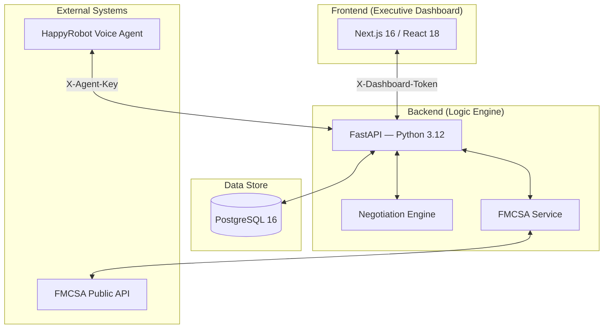

# HappyFDE — AI-Driven Freight Brokerage Platform

Automate inbound carrier sales with a voice AI agent, real-time FMCSA verification, stateful price negotiation, and an executive monitoring dashboard.

## 🚀 Business Value Proposition

HappyFDE bridges the gap between raw logistics data and profitable carrier negotiations. The platform integrates a voice AI agent (Paul) with industry-standard cargo intelligence to reduce operational overhead and maximize broker spreads.

### Key Operational Features

- **AI Voice Agent (Paul)**: Handles inbound carrier calls end-to-end — verifies authority, searches loads, negotiates price, and books — without human intervention.
- **Stateful Negotiation Engine**: Multi-round pricing logic anchored to market rates, with automatic margin protection and scam detection.
- **Executive Dashboard**: Real-time monitoring of net profit, conversion rates, automation rate, and live call transcripts.
- **FMCSA Integration**: Instant carrier authority verification with 24-hour caching.
- **Strategic Privacy Guard**: Shipper category exposure model prevents broker-client data leakage.

---

## 🏗️ System Architecture



### Stack

| Layer          | Technology                                          |
| -------------- | --------------------------------------------------- |
| Backend        | Python 3.12, FastAPI, SQLAlchemy 2.0, Alembic       |
| Frontend       | Next.js 16, React 18, TypeScript, Tailwind, Recharts|
| Database       | PostgreSQL 16                                       |
| Infrastructure | Docker, Terraform, GCP Cloud Run + Cloud SQL        |
| Testing        | pytest (backend), Jest + RTL (frontend)             |

### Deployment

- **Containers**: Multi-stage Dockerfiles for backend and frontend.
- **Cloud**: Google Cloud Run (serverless) + Cloud SQL (PostgreSQL) on a private VPC.
- **IaC**: Full Terraform configuration in [`/terraform`](./terraform).
- **Secrets**: Google Secret Manager for production credentials.

---

## 🌟 Key Features

### 1. Executive Pulsation Dashboard

High-density interface for data-driven decisions:

- **KPI Panel**: Revenue, net margin %, automation rate, avg time-to-cover.
- **Carrier Outcome Analysis**: Real-time distribution of booked vs no-agreement vs rejected.
- **Live Communication Feed**: Live transcripts of active calls with SSE push (2s interval).
- **Loads Management**: Two-panel view with searchable list and detailed load tabs.

### 2. Dual Authentication

- `X-Agent-Key` — voice agent access only (never grants admin).
- `X-Dashboard-Token` — AES-encrypted in localStorage, dashboard only.

---

## 🚀 Getting Started (Local)

**Prerequisites**: Docker, Python 3.12+, Node.js 20+, [`uv`](https://github.com/astral-sh/uv)

### 1. Database

```bash
docker run -d --name happyfde-db \
  -p 5433:5432 \
  -e POSTGRES_DB=happyrobot \
  -e POSTGRES_USER=postgres \
  -e POSTGRES_PASSWORD=postgres \
  postgres:16-alpine
```

### 2. Backend

```bash
cd backend
cp .env.example .env        # configure FMCSA_API_KEY if needed
uv sync
uv run alembic upgrade head
uv run python -m app.seed   # loads 36 loads, 18 carriers, 4 shippers
uv run uvicorn app.main:app --reload --port 8000
```

### 3. Frontend

```bash
cd frontend
npm install
npm run dev                 # http://localhost:3000
```

### 4. Full stack with Docker Compose

```bash
docker compose up --build
# API       → http://localhost:8000
# Dashboard → http://localhost:3000
```

### Default credentials (dev)

| Key              | Value                                    |
| ---------------- | ---------------------------------------- |
| `AGENT_API_KEY`  | `hr-agent-key-change-in-production`      |
| `DASHBOARD_TOKEN`| `hr-dashboard-token-change-in-production`|

---

## 🧪 Tests

```bash
# Backend (107 tests)
cd backend && uv run pytest -v

# Frontend (18 tests)
cd frontend && npm test
```

---

## 🔐 Security & Operations

- **Private Networking**: Cloud SQL is inaccessible from the public internet via Google VPC peering.
- **Secret Management**: All production credentials live in Google Secret Manager.
- **Rate field isolation**: `max_rate` and `min_rate` are stored in DB but excluded from every API response schema.
- **Observability**: Google Cloud Logging for real-time traffic analysis.

---

## 📂 Project Structure

```text
happyFDE/
├── backend/          # FastAPI app, models, services, migrations
├── frontend/         # Next.js dashboard
├── terraform/        # GCP infrastructure (Cloud Run, Cloud SQL, VPC)
├── docker-compose.yml
└── DEPLOYMENT.md     # Production deployment guide
```

---

*Developed for the HappyRobot FDE Technical Challenge — Acme Logistics.*
