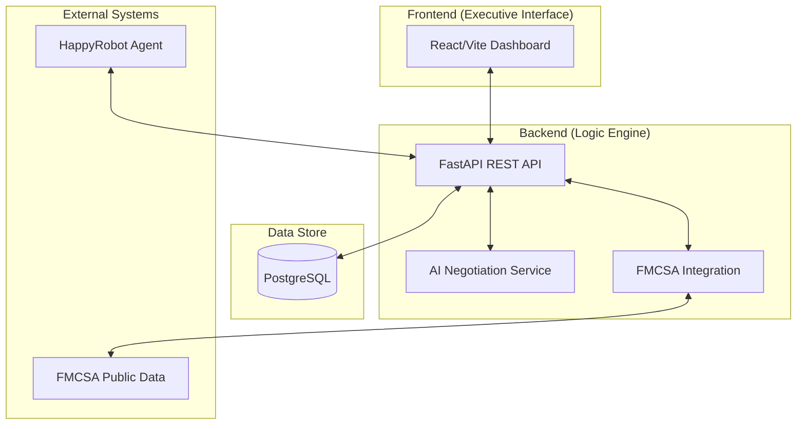

# HappyFDE — AI-Driven Freight Brokerage Platform

Automate your inbound carrier sales with high-fidelity cargo intelligence and secure negotiation.

## 🚀 Business Value Proposition

HappyFDE bridges the gap between raw logistics data and profitable carrier negotiations. By integrating industry-standard cargo specifications with an advanced AI negotiation agent, the platform reduces operational overhead and maximizes spreads.

### Key Operational Features
- **Standardized Cargo Intelligence**: Automatic generation of industry-standard dimensions and operational notes (PPE requirements, FCFS rules).
- **Executive Dashboard**: High-density UI for real-time monitoring of net profit, conversion rates, and automation efficiency.
- **Strategic Privacy Guard**: Integrated "Shipper Category" pitching to prevent data leakage and protect broker-client relationships.
- **Automated Negotiation**: Multi-round pricing logic optimized for maximum broker spread.

---

## 🏗️ System Architecture

The solution is built on a modern, decoupled stack designed for scalability and high-availability deployment.

### Deployment Strategy
- **Infrastructure**: Containerized using Docker, deployed to Google Cloud Platform via Cloud Run.
- **Data Persistence**: Secured using Cloud SQL (PostgreSQL).
- **CI/CD**: Automated deployment pipelines through GitHub Actions.

---

## 📂 Project Organization
- [Backend Codebase](./backend) — Logic, API, and Database models.
- [Frontend Dashboard](./frontend) — React-based executive UI.
- [Deployment Guide](./DEPLOYMENT.md) — Steps to reproduce the production build.

---
*Developed for the HappyRobot FDE Technical Challenge.*
